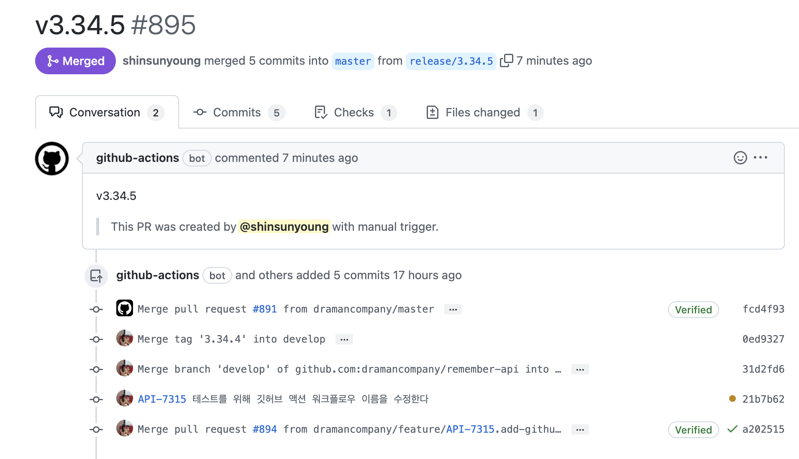
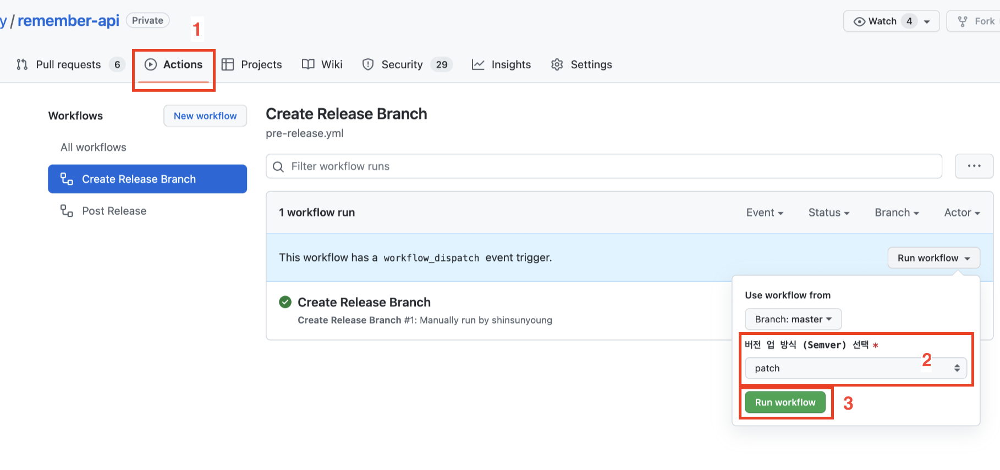
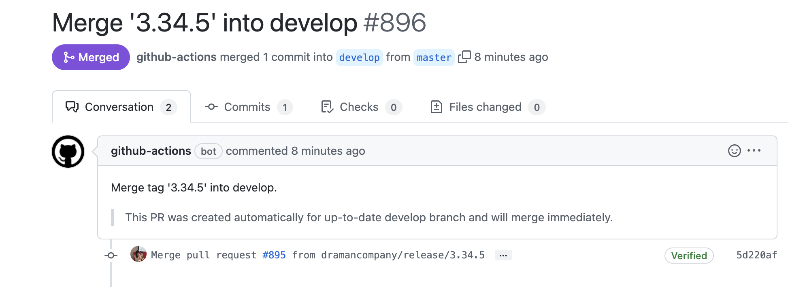
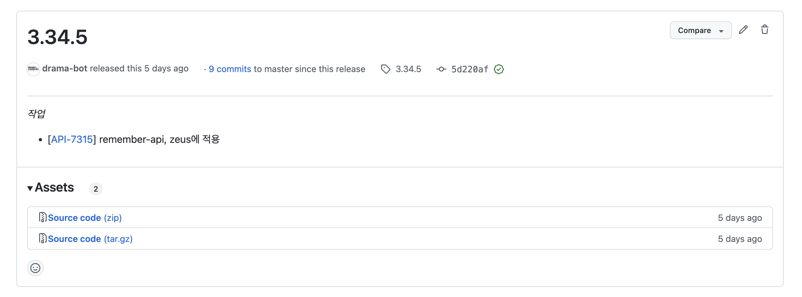
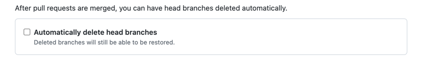
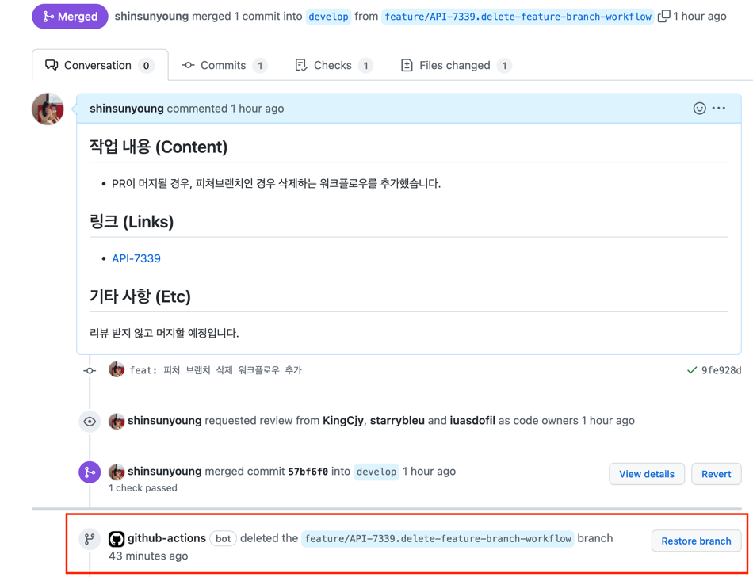

# Drama&amp;Company Shared Workflows
Github에서 자주 사용하는 기능들을 자동화할 수 있도록 워크플로우를 모아두었습니다.


# Workflows
## [prepare-release](https://github.com/dramancompany/shared_workflows/blob/server/.github/workflows/prepare-release.yml)
### 소개
**publish 되어있는 태그 중에 가장 마지막 버전의 태그 버전을 가져와 다음 버전으로 릴리즈 브랜치를 만들고 PR을 생성**합니다.  

원하는 커밋들을 develop에 머지한 후, 1) 깃허브의 [Actions] 메뉴에 들어간 후 2) 원하는 버전 업 방식(patch/minor/major)을 선택합니다. 3) 그 후 워크플로우를 실행합니다.
  
*단, release 브랜치에 추가로 작업해주어야 하는 경우 만들어진 브랜치로 checkout하여 추가로 작업해주어야 합니다. (ex. zeus 프로젝트 버전 업데이트)*



### 적용방법
적용을 원하는 프로젝트의 .github/workflows/pre-release.yml 파일을 생성합니다.
```yaml
name: Create Release

on:
  workflow_dispatch:
    inputs:
      bumpLevel:
        description: '버전 업 방식 (Semver) 선택'
        required: true
        default: 'patch'
        type: choice
        options:
          - major
          - minor
          - patch

jobs:
  prepare-release:
    uses: dramancompany/shared_workflows/.github/workflows/prepare-release.yml@server
    with:
      bumpLevel: ${{ inputs.bumpLevel }}
      mainBranch: master # 마스터 브랜치가 main이라면 main을 적어줍니다.
    secrets: inherit
```

- [적용 예시(UTS)](https://github.com/dramancompany/user-targeting-system/blob/master/.github/workflows/pre-release.yml)

## [post-release](https://github.com/dramancompany/shared_workflows/blob/server/.github/workflows/post-release.yml)
master 브랜치에 pr이 머지되면 git flow finish와 jira release를 자동으로 해줍니다. 아래와 같은 순서로 동작합니다. (자동으로 머지되니 꼭 확인 부탁드립니다!)

[git flow finish]
1. develop <- master로 향하는 PR 생성 & 머지
2. 릴리즈 브랜치 삭제
3. 릴리즈 태그 생성 & push



[jira release]
5. 커밋 중에서 API-XXX 커밋을 찾아 Done 처리
6. 릴리즈 생성 & 릴리즈 (-> 후에는 [jira release bot](https://github.com/dramancompany/lambda-release-jira-to-github)이 돌아 자동으로 패치 노트 작성)



*해당 워크플로우에는 릴리즈 브랜치를 삭제하는 단계가 포함되어있기 때문에 자동으로 브랜치를 삭제해주는 기능(Automatically delete head branches)을 꺼두는 것이 좋습니다. 만약 feature 브랜치의 경우에 자동으로 삭제되길 원한다면 delete-feature-branch 워크플로우와 함께 사용해주세요*



### 적용방법
적용을 원하는 프로젝트의 .github/workflows/post-release.yml 파일을 생성합니다.
```yaml
name: Post Release

on:
  pull_request:
    types: [ closed ]
    branches: [ master ] # 마스터 브랜치가 main이라면 main을 적어줍니다.

jobs:
  post-release:
    if: ${{ github.event.pull_request.merged }}
    uses: dramancompany/shared_workflows/.github/workflows/post-release.yml@server
    with:
      jiraProjectKey: API # 지라 프로젝트의 이름을 적어줍니다.
      jiraVersionPrefix: uts- # 릴리즈 버전의 prefix를 적어줍니다. 
      devBranch: develop
      mainBranch: master # 마스터 브랜치가 main이라면 main을 적어줍니다.
    secrets: inherit
```

- [적용 예시(UTS)](https://github.com/dramancompany/user-targeting-system/blob/master/.github/workflows/post-release.yml)

## [delete-feature-branch](https://github.com/dramancompany/shared_workflows/blob/server/.github/workflows/delete-feature-branch.yml)
pr이 머지된 경우, 브랜치 이름이 feature로 시작한다면 자동으로 삭제합니다.



### 적용방법
적용을 원하는 프로젝트의 .github/workflows/delete-feature-branch.yml 파일을 생성합니다.
```yaml
name: Delete Feature Branch

on:
  pull_request:
    types: [ closed ]

jobs:
  post-release:
    if: ${{ github.event.pull_request.merged }}
    uses: dramancompany/shared_workflows/.github/workflows/delete-feature-branch.yml@server
    with:
      mainBranch: master # 마스터 브랜치가 main이라면 main을 적어줍니다.
    secrets: inherit
```

- [적용 예시(UTS)](https://github.com/dramancompany/user-targeting-system/blob/master/.github/workflows/delete-feature-branch.yml)
